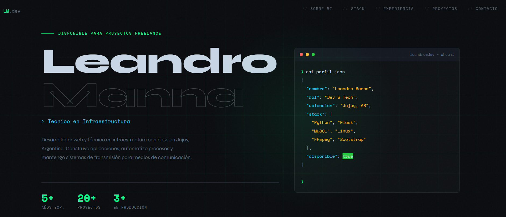

# 👨‍💻 Leandro Manna — Portafolio

Sitio web personal orientado a desarrollo, automatización y administración de sistemas. Diseñado con una estética moderna tipo *dark/terminal* y optimizado para mostrar proyectos, stack técnico y experiencia.

---

## 🚀 Stack

* **Frontend:** HTML5, CSS3, Bootstrap 5
* **Backend / Scripts:** Python (Flask)
* **Base de datos:** MySQL
* **Infra / Tools:** Linux, FFmpeg

---

## 🎯 Objetivo del proyecto

Este portafolio está pensado para:

* Mostrar proyectos reales (automatización, scraping, streaming)
* Centralizar información profesional
* Servir como punto de contacto para trabajos freelance

---

## 🧠 Características

* Diseño *dark mode* con estética developer
* Secciones claras: Sobre mí, Stack, Experiencia, Proyectos, Contacto
* UI basada en terminal (`perfil.json`)
* Responsive (Bootstrap)
* Optimización visual (tipografías modernas + contraste alto)

---

## 📂 Estructura del proyecto

```
/
├── index.html
├── css/
│   └── styles.css
├── assets/
│   └── img/
└── js/
```

---

## ⚙️ Instalación

1. Clonar repositorio:

```bash
git clone https://github.com/tuusuario/tu-repo.git
```

2. Abrir `index.html` directamente o levantar con servidor local:

```bash
python -m http.server
```

---

## 🧩 Personalización

Podés adaptar fácilmente:

* Colores desde `styles.css`
* Contenido del perfil (bloque tipo JSON en UI)
* Proyectos agregando nuevas cards
* Favicon en `/assets`

---

## 📸 Preview



---

## 📬 Contacto

* Ubicación: Jujuy, Argentina
* Disponible para proyectos freelance

---

## 🧑‍🔧 Autor

**Leandro Manna**
Dev & Tech

---

## 📄 Licencia

MIT
